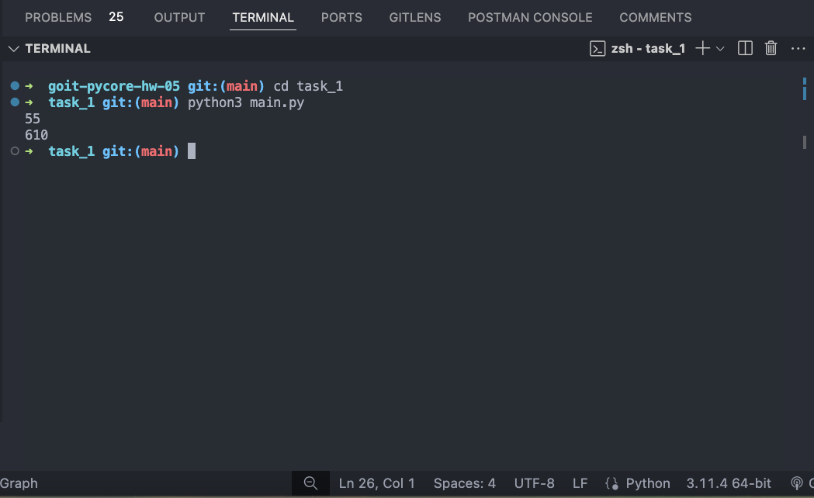
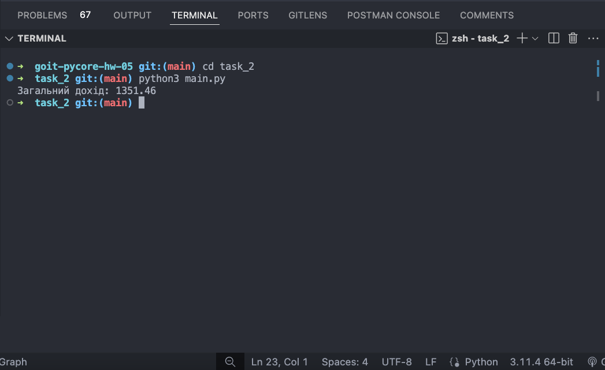
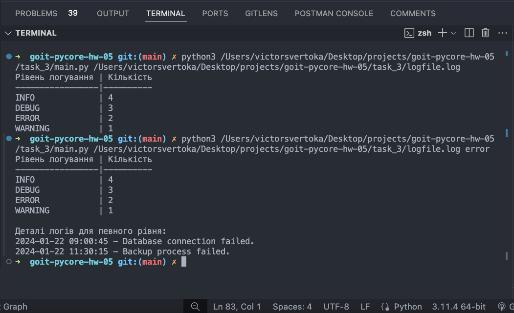
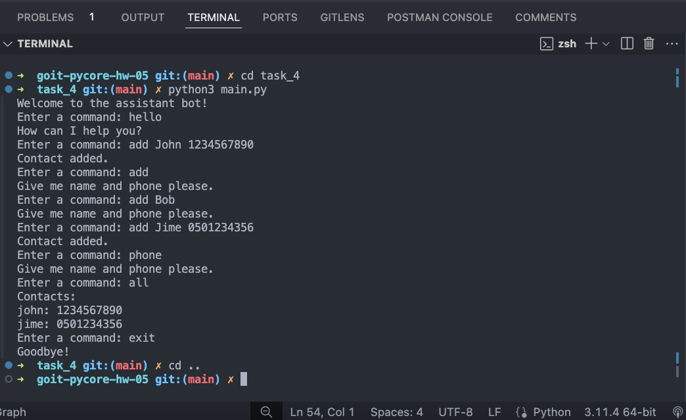

# Тема 8. Домашня робота. Функціональне програмування та вбудовані модулі Python

**Зараз на вас чекає домашнє завдання, завдяки якому ви навчитеся наступним корисним навичкам:**

- Принципи рекурсії та використання пам’яті для оптимізації алгоритмів
- Використання функцій в якості аргументів.
- Створення та використання кортежів для повернення кількох значень з функції.
- Використання генераторів для ефективної ітерації та обробки великих об'ємів даних.
- Використання функціонального підходу, такого як використання функцій в якості аргументів та застосування функцій в функціональному стилі.
- Концепція декораторів та їх застосування для обробки помилок.

### Формат здачі:

- Розмістіть файли з розв'язанням у репозиторії `goit-pycore-hw-05`, та прикріпіть лінки до них у відповідь на домашнє завдання.
- Прикріпіть файл репозиторію у форматi `zip` у відповідь на домашнє завдання.

> [!TIP]
>
> Звернiть увагу, що виконання Завдання 3 не обов’язкове для здачі цієї домашньої роботи.

## Технiчний опис завдання

### Завдання 1

Замикання в програмуванні - це функція, яка зберігає посилання на змінні зі свого лексичного контексту, тобто з області, де вона була оголошена.

Реалізуйте функцію `caching_fibonacci`, яка створює та використовує кеш для зберігання і повторного використання вже обчислених значень чисел Фібоначчі.

**Ряд Фібоначчі** - це послідовність чисел виду: `0, 1, 1, 2, 3, 5, 8, ...`, де кожне наступне число послідовності виходить додаванням двох попередніх членів ряду.

У загальному вигляді для обчислення `n`-го члена ряду Фібоначчі потрібно вирахувати вираз: `𝐹𝑛 = 𝐹𝑛−1 + 𝐹𝑛−2`.

Це завдання можна вирішити рекурсивно, викликаючи функцію, що обчислює числа послідовності доти, доки виклик не сягне членів ряду менше `n = 1`, де послідовність задана.

#### Вимоги до завдання:

1. Функція `caching_fibonacci()` повинна повертати внутрішню функцію `fibonacci(n)`.
2. `fibonacci(n)` обчислює `n`-те число Фібоначчі. Якщо число вже знаходиться у кеші, функція має повертати значення з кешу.
3. Якщо число не знаходиться у кеші, функція має обчислити його, зберегти у кеш та повернути результат.
4. Використання рекурсії для обчислення чисел Фібоначчі.

#### Рекомендації для виконання:

В якості рекомендації ми надамо псевдо код завдання.

☝ **Псевдокод** - це спосіб запису алгоритму або програмного коду, який використовується для опису ідеї або процесу у вигляді, зрозумілому для людей. Він не призначений для безпосереднього виконання на комп'ютері, але допомагає розробникам чітко зрозуміти та спланувати, як буде працювати програма чи алгоритм. Головна його мета - передати ідею алгоритму чітко та просто.

Ось псевдокод для функції `caching_fibonacci`, яка обчислює числа Фібоначчі з використанням кешування:

```bash
ФУНКЦІЯ caching_fibonacci
Створити порожній словник cache

    ФУНКЦІЯ fibonacci(n)
        Якщо n <= 0, повернути 0
        Якщо n == 1, повернути 1
        Якщо n у cache, повернути cache[n]

        cache[n] = fibonacci(n - 1) + fibonacci(n - 2)
        Повернути cache[n]

    Повернути функцію fibonacci

КІНЕЦЬ ФУНКЦІЇ caching_fibonacci
```

Функція `caching_fibonacci` створює внутрішню функцію `fibonacci` і словник cache для зберігання результатів обчислення чисел Фібоначчі. Кожен раз, коли викликається `fibonacci(n)`, спочатку перевіряється, чи вже збережено значення для `n` у `cache`. Якщо значення є у кеші, воно повертається негайно, що значно зменшує кількість рекурсивних викликів. Якщо значення відсутнє у кеші, воно обчислюється рекурсивно і зберігається у cache. Функція `caching_fibonacci` повертає внутрішню функцію `fibonacci`, яка тепер може бути використана для обчислення чисел Фібоначчі з використанням кешування.

#### Критерії оцінювання:

1. Коректність реалізації функції fibonacci(n) з урахуванням використання кешу.
2. Ефективне використання рекурсії та кешування для оптимізації обчислень.
3. Чистота коду, включаючи читабельність та наявність коментарів.

#### Приклад використання:

```bash
# Отримуємо функцію fibonacci

fib = caching_fibonacci()

# Використовуємо функцію fibonacci для обчислення чисел Фібоначчі

print(fib(10)) # Виведе 55
print(fib(15)) # Виведе 610
```

У цьому прикладі, коли ви викликаєте `fib(10)` або `fib(15)`, функція `fibonacci` всередині `caching_fibonacci` обчислює відповідні числа Фібоначчі, зберігаючи попередні результати у кеші. Це робить повторні виклики для тих самих значень `n` значно швидшими, оскільки вони просто повертають значення з кешу. Замикання дозволяє `fibonacci(n)` "пам'ятати" стан `cache` між різними викликами, що є ключовим для кешування результатів обчислень

### Завдання 2

Необхідно створити функцію `generator_numbers`, яка буде аналізувати текст, ідентифікувати всі дійсні числа, що вважаються частинами доходів, і повертати їх як генератор. Дійсні числа у тексті записані без помилок, чітко відокремлені пробілами з обох боків. Також потрібно реалізувати функцію `sum_profit`, яка буде використовувати `generator_numbers` для підсумовування цих чисел і обчислення загального прибутку.

#### Вимоги до завдання:

1. Функція `generator_numbers(text: str)` повинна приймати рядок як аргумент і повертати генератор, що ітерує по всіх дійсних числах у тексті. Дійсні числа у тексті вважаються записаними без помилок і чітко відокремлені пробілами з обох боків.
2. Функція `sum_profit(text: str, func: Callable)` має використовувати генератор `generator_numbers` для обчислення загальної суми чисел у вхідному рядку та приймати його як аргумент при виклику.

#### Рекомендації для виконання:

1. Використовуйте регулярні вирази для ідентифікації дійсних чисел у тексті, з урахуванням, що числа чітко відокремлені пробілами.
2. Застосуйте конструкцію yield у функції `generator_numbers` для створення генератора.
3. Переконайтеся, що sum_profit коректно обробляє дані від `generator_numbers` і підсумовує всі числа.

#### Критерії оцінювання:

Правильність визначення та повернення дійсних чисел функцією `generator_numbers`.
Коректність обчислення загальної суми в `sum_profit`.
Чистота коду, наявність коментарів та відповідність стилю кодування `PEP8`.

#### Приклад використання:

```bash
text = "Загальний дохід працівника складається з декількох частин: 1000.01 як основний дохід, доповнений додатковими надходженнями 27.45 і 324.00 доларів."
total_income = sum_profit(text, generator_numbers)
print(f"Загальний дохід: {total_income}")
```

#### Очікуване виведення:

```bash
Загальний дохід: 1351.46
```

### Завдання 3 (не обов'язкове)

Розробіть Python-скрипт для аналізу файлів логів. Скрипт повинен вміти читати лог-файл, переданий як аргумент командного рядка, і виводити статистику за рівнями логування наприклад, `INFO`, `ERROR`, `DEBUG`. Також користувач може вказати рівень логування як другий аргумент командного рядка, щоб отримати всі записи цього рівня.

Файли логів – це файли, що містять записи про події, які відбулися в операційній системі, програмному забезпеченні або інших системах. Вони допомагають відстежувати та аналізувати поведінку системи, виявляти та діагностувати проблеми.

Для виконання завдання візьміть наступний приклад лог-файлу:

```bash
2024-01-22 08:30:01 INFO User logged in successfully.
2024-01-22 08:45:23 DEBUG Attempting to connect to the database.
2024-01-22 09:00:45 ERROR Database connection failed.
2024-01-22 09:15:10 INFO Data export completed.
2024-01-22 10:30:55 WARNING Disk usage above 80%.
2024-01-22 11:05:00 DEBUG Starting data backup process.
2024-01-22 11:30:15 ERROR Backup process failed.
2024-01-22 12:00:00 INFO User logged out.
2024-01-22 12:45:05 DEBUG Checking system health.
2024-01-22 13:30:30 INFO Scheduled maintenance.
```

#### Вимоги до завдання:

1. Скрипт повинен приймати шлях до файлу логів як аргумент командного рядка.
2. Скрипт повинен приймати не обов'язковий аргумент командного рядка, після аргументу шляху до файлу логів. Він відповідає за виведення всіх записи певного рівня логування. І приймає значення відповідно до рівня логування файлу. Наприклад аргумент `error` виведе всі записи рівня `ERROR` з файлу логів.
3. Скрипт має зчитувати і аналізувати лог-файл, підраховуючи кількість записів для кожного рівня логування (`INFO`, `ERROR`, `DEBUG`, `WARNING`).
4. Реалізуйте функцію `parse_log_line(line: str) -> dict` для парсингу рядків логу.
5. Реалізуйте функцію `load_logs(file_path: str) -> list` для завантаження логів з файлу.
6. Реалізуйте функцію `filter_logs_by_level(logs: list, level: str) -> list` для фільтрації логів за рівнем.
7. Реалізуйте функцію `count_logs_by_level(logs: list) -> dict` для підрахунку записів за рівнем логування.
8. Результати мають бути представлені у вигляді таблиці з кількістю записів для кожного рівня. Для цього реалізуйте функцію `display_log_counts(counts: dict)`, яка форматує та виводить результати. Вона приймає результати виконання функції `count_logs_by_level`.

#### Рекомендації для виконання:

1. Перш ніж почати, ознайомтеся зі структурою вашого лог-файлу. Зверніть увагу на формат дати та часу, рівні логування `INFO`, `ERROR`, `DEBUG`, `WARNING` і структуру повідомлень.
2. Зрозумійте, як розділені різні компоненти логу, це зазвичай пробіли або спеціальні символи.
3. Розділіть ваше завдання на логічні блоки і функції для кращої читабельності і подальшого розширення.
4. Парсинг рядка логу виконує \*\*\*\*функцію `parse_log_line(line: str) -> dict`, яка приймає рядок з логу як вхідний параметр і повертає словник з розібраними компонентами: дата, час, рівень, повідомлення. Використовуйте методи рядків, такі як `split()`, для розділення рядка на частини.
5. Завантаження лог-файлів виконує функція `load_logs(file_path: str) -> list`, що відкриває файл, читає кожен рядок і застосовує на нього функцію `parse_log_line`, зберігаючи результати в список.
6. Фільтрацію за рівнем логування виконує функція `filter_logs_by_level(logs: list, level: str) -> list`. Вона дозволить вам отримати всі записи логу для певного рівня логування.
7. Підрахунок записів за рівнем логування повинна робити функція `count_logs_by_level(logs: list) -> dict`, яка проходить по всім записам і підраховує кількість записів для кожного рівня логування.
8. Вивід результатів виконайте за допомоги функції `display_log_counts(counts: dict)`, яка форматує та виводить результати підрахунку в читабельній формі.
9. Ваш скрипт повинен вміти обробляти різні види помилок, такі як відсутність файлу або помилки при його читанні. Використовуйте блоки `try/except` для обробки виняткових ситуацій.

#### Критерії оцінювання:

- Скрипт виконує всі зазначені вимоги, правильно аналізуючи лог-файли та виводячи інформацію.
- Скрипт коректно обробляє помилки, такі як неправильний формат лог-файлу або відсутність файлу.
- При розробці обов'язково було використано один з елементів функціонального програмування: лямбда-функція, списковий вираз, функція `filter`, тощо.
- Код добре структурований, зрозумілий і містить коментарі там, де це необхідно.

#### Приклад використання:

При запуску скрипту

```bash
python [main.py](http://main.py/) /path/to/logfile.log
```

Ми повинні очікувати наступне виведення

```bash
| Рівень логування | Кількість |
| ---------------- | --------- |
| INFO             | 4         |
| DEBUG            | 3         |
| ERROR            | 2         |
| WARNING          | 1         |
```

Якщо користувач хоче переглянути всі записи певного рівня логування, він може запустити скрипт з додатковим аргументом, наприклад:

```bash
python main.py path/to/logfile.log error
```

Це виведе загальну статистику за рівнями, а також детальну інформацію для всіх записів з рівнем `ERROR`.

```bash
| Рівень логування | Кількість |
| ---------------- | --------- |
| INFO             | 4         |
| DEBUG            | 3         |
| ERROR            | 2         |
| WARNING          | 1         |

Деталі логів для рівня 'ERROR':
2024-01-22 09:00:45 - Database connection failed.
2024-01-22 11:30:15 - Backup process failed.
```

### Завдання 4

Доробіть консольного бота помічника з попереднього домашнього завдання та додайте обробку помилок за допомоги декораторів.

#### Вимоги до завдання:

1. Всі помилки введення користувача повинні оброблятися за допомогою декоратора `input_error`. Цей декоратор відповідає за повернення користувачеві повідомлень типу `"Enter user name"`, `"Give me name and phone please"` тощо.
2. Декоратор `input_error` повинен обробляти винятки, що виникають у функціях - `handler` і це винятки: `KeyError`, `ValueError`, `IndexError`. Коли відбувається виняток декоратор повинен повертати відповідну відповідь користувачеві. Виконання програми при цьому не припиняється.

#### Рекомендації для виконання:

В якості прикладу додамо декоратор `input_error` для обробки помилки `ValueError`

```bash
def input_error(func):
def inner(*args, \*\*kwargs):
try:
return func(*args, \*\*kwargs)
except ValueError:
return "Give me name and phone please."

    return inner
```

Та обгорнемо декоратором функцію `add_contact` нашого бота, щоб ми почали обробляти помилку `ValueError`.

```bash
@input_error
def add_contact(args, contacts):
name, phone = args
contacts[name] = phone
return "Contact added."
```

Вам треба додати обробники до інших команд (функцій), та додати в декоратор обробку винятків інших типів з відповідними повідомленнями.

#### Критерії оцінювання:

1. Наявність декоратора input_error, який обробляє помилки введення користувача для всіх команд.
2. Обробка помилок типу KeyError, ValueError, IndexError у функціях за допомогою декоратора input_error.
3. Кожна функція для обробки команд має власний декоратор input_error, який обробляє відповідні помилки і повертає відповідні повідомлення про помилку.
4. Коректна реакція бота на різні команди та обробка помилок введення без завершення програми.

#### Приклад використання:

При запуску скрипту діалог з ботом повинен бути схожим на цей.

```bash
Enter a command: add
Enter the argument for the command
Enter a command: add Bob
Enter the argument for the command
Enter a command: add Jime 0501234356
Contact added.
Enter a command: phone
Enter the argument for the command
Enter a command: all
Jime: 0501234356
Enter a command:
```

### Результат виконаного ДЗ

1.



2.



3.



4.


